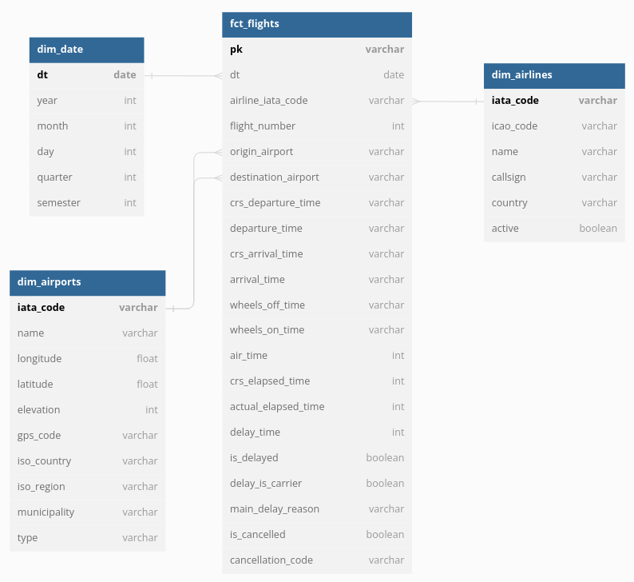

# Capstone Project
This is the capstone project of the Data Engineering Nanodegree from Udacity. 

In this project we build the ETL pipeline of an analytical data model of flights delays and cancellations. As an example, this data could be used by companies or even users to identify patterns in these delays or cancellations and use this information to make better decisions when planning trips.

Since it's a data model for analytical (and not transactional) purposes, a daily update (daily run of the workflow) should be necessary.
## Data model
For the data model we have chosen the star-schema, making it easy to aggregate data on the `fct_flights` table and at the same time easy to join with dimension tables for filtering and specifying aggregation parameters. This is justified further, considering that this model is to be used for analytical purposes.



The model is composed of:
- `fct_flights` - fact table with each line being a flight as the granularity
    - partitioned by: `dt`
- `dim_date` - dimension table opening the data info in year, month, day, quarter and semester to facilitate the clusterization of flights data in thes timespans
- `dim_airports` - dimension table with more information about airports
    - partitioned by: `iso_country`
- `dim_airlines` - dimension table with more data about airlines
    - partitioned by: `country`

A data dictionary can be found [here](./DATA-DICTIONARY.md)
## Data pipeline
The steps performed for each transformation are:
1. Read data in `.csv` or `.json` format from a s3 bucket
2. Transform the data using spark functions and methods
3. Write the data to another s3 bucket in `.parquet` format

For development and POC we are running the etl process locally, but in production we would run it on a cloud provider, for example, submitting it to an EMR cluster on AWS.
## Project steps
The major steps taken in the project were:
1. Find a data for the project with following prerequisites:
    - at least 2 different sources
    - at least 2 different formats
    - at leas 1M rows
2. Explore the data
    - More info in first part of `data_exploration.ipynb` 
3. Develop the data model (fact and dimension tables)
    - More info second part of `data_explorations.ipynb`
4. Develop the ETL
5. Develop Airflow DAG and Docker environment
## Data sources
- Flights:
    - [source](https://www.kaggle.com/datasets/yuanyuwendymu/airline-delay-and-cancellation-data-2009-2018)
    - file format: `csv`
    - lines: 63M
- Airlines:
    - [source](https://www.kaggle.com/datasets/open-flights/airline-database)
    - file format: `csv`
    - lines: 6k 
- Airports:
    - [source](https://datahub.io/core/airport-codes)
    - file format: `json`
    - lines: 57k
## Tools
Spark is being used to transform the data, writing it to `parquet` files, since it's one of the industry standards for big data. This means that it's easily scalable (e.g. using cloud solutions) and there are a lot of tools that use it (e.g. Databricks), which make it easier to create a more robust system to deploy the ETL.

We save the data to s3, since we save data in files (`parquet`) and are using AWS, the most used cloud provider. 
## Addressing other scenarios
What should be done if:
- The data was increased by 100x.
    - This should be no problem since we're using Spark. Only the clusters would have to be scaled (size and maybe type) to attend the higher processin power. 
- The pipelines would be run on a daily basis by 7 am every day.
    - The pipeline would have to be scheduled through a cron job or an orchestrator (like airflow) to run at this time
- The database needed to be accessed by 100+ people.
    - The cluster used by the people to query the data would have to be scaled accordingly. If this were in a company and they were still querying the data manually, the company should consider implementing a BI tool
## How to run the code
You can run the ETL either through the `flights_etl.py` file directly, installing all the dependencies or through Apache Airflow running within the Docker container
### Bare Python script
1. Create IAM user with:
    1. Programatig access
    2. Attached Policies:
        - AdministratorAccess
        - AmazonS3FullAccess
2. Create two s3 buckets:
    - One for the source data
    - One for the transformed tables that will be in the `.parquet` format
3. Add IAM access and secret key into a file called `dl.cfg` (use the supplied `example_dl.cfg`)
4. Create a virtual environment with Poetry through `$ poetry install` and access it with `$ poetry shell`
5. Run `$ python flights_etl.py`
### Airflow
1. Create the Docker container:
    ```
    cd docker
    docker build -t airflow-fred:latest .
    cd ..
    ```
2. Run the Docker container:
    ```
    docker compose up -d 
    ```
3. Access Airflow at `localhost:8080` in your web browser
    - user: `admin`
    - pwd: `admin`
4. Add following connections in the Airflow UI:
    - Spark local:
        - Name: `spark_local`
        - Connection Type: `Spark`
        - Host: `local[*]
    - AWS:
        - Name: `aws_credentials`
        - Connection Type: `Amazon Web Services`
        - AWS Access Key ID: `<your aws access key id>`
        - AWS Access Key Secret: `< youar awd access key secret>`
5. Activate and run dag in Airflow UI
6. After finishing, shut down the running container:
    ```
    docker compose down
    ```
## References
- For delay and cancellation codes: [BTS - Technical Directive: On-Time Reporting](https://www.bts.gov/topics/airlines-and-airports/number-23-technical-directive-time-reporting-effective-jan-1-2014)
- Specifications about the delay categories: [BTS - Understanding the Reporting of Causes of Flight Delays and Cancellations](https://www.bts.gov/topics/airlines-and-airports/understanding-reporting-causes-flight-delays-and-cancellations)
- Glossary for further terms: [BTS - Glossary](https://www.transtats.bts.gov/Glossary.asp)
- Instructions for creating the Docker image: [Deploying Airflow with Docker](https://medium.com/lynx-data-engineering/deploying-airflow-with-docker-20c72821bc7b)
- For information about jar packages (Spark and Hadoop for Docker env) [Maven Repository](https://mvnrepository.com/)
## Dependencies
- For development create a Poetry env using the `pyproject.toml` and `poetry.lock` files.